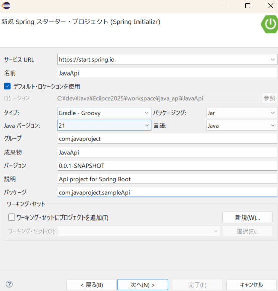
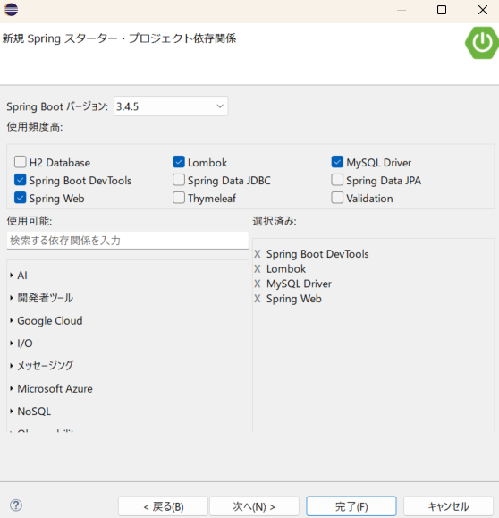

# SpringBoot_Api導入

## SpringBoot_Apiのプロジェクト立ち上げ方法

- 新規 > その他
- Spring Boot > Springスターター・プロジェクト」を選択して、「次へ」


### スターター依存関係



- [Lombokについて](https://qiita.com/opengl-8080/items/671ffd4bf84fe5e32557)
  - Lombokとは、Javaの冗長なコードを削減するためのライブラリです。アノテーションを使って、getter、setter、toString、equals、hashCodeなどのメソッドや、コンストラクタを自動生成することで、コード量を減らし、開発効率を向上させます。

- [spring boot devtools とは](https://qiita.com/IsaoTakahashi/items/f99d5f761d1d4190860d)

### コントロール・ソースの作成
```java
package com.javaproject.sampleApi.controller;
import org.springframework.web.bind.annotation.CrossOrigin;
import org.springframework.web.bind.annotation.GetMapping;
import org.springframework.web.bind.annotation.RequestMapping;
import org.springframework.web.bind.annotation.RestController;
import com.javaproject.sampleApi.dto.SampleMessage;

@CrossOrigin(origins = "http://localhost:3000")
@RestController
@RequestMapping("/api")
public class ApiController {
	@GetMapping("/helloAPI")
	public SampleMessage hello() {
		String message = "ようこそ。Java Api 入門！";
		SampleMessage msg = new SampleMessage();
		msg.setMessage(message);
		return msg;
	}
}
```

### dto:定義クラスの作成
```java
package com.javaproject.sampleApi.dto;

public class SampleMessage {
	private String message;
	public String getMessage() {
		return message;
	}
	public void setMessage(String message) {
		this.message = message;
	}
}
```

### ビルド
- 「Gradleタスク」 > 「build」 > 「build」 > 「Gradleタスク」を実行

### プロジェクトの実行
- プロジェクトを右クリックして、「実行 > Spring Boot アプリケーション」を選択
- 「http://localhost:8080/helloAPI」にアクセス

### 実行例
```sh
{"message":"ようこそ。Java Api 入門！"}
```

## 【Java】mysqlサーバからデータ取得

### Gradleの設定
```
dependencies {
	runtimeOnly 'com.mysql:mysql-connector-j'
	implementation 'jakarta.persistence:jakarta.persistence-api:3.1.0'
	implementation 'org.springframework.boot:spring-boot-starter-data-jpa'
	testRuntimeOnly 'org.junit.platform:junit-platform-launcher'
	implementation 'jakarta.persistence:jakarta.persistence-api:3.1.0'
	implementation 'org.springframework.boot:spring-boot-starter-data-jpa'
}
```

### application.propertiesにてMysql接続設定
```sh
spring.datasource.url=jdbc:mysql://localhost:3306/your_database?serverTimezone=Asia/Tokyo
spring.datasource.username=your_username
spring.datasource.password=your_password
#データベースのスキーマの扱い設定(none:DDL文を一切実行しない)
spring.jpa.hibernate.ddl-auto=none
#実行されるSQL文をコンソールに出力
spring.jpa.show-sql=true
```

### エンティティクラスの作成

- 例えば：sqlのテーブルが下記の場合
```sql
CREATE TABLE users (
  id INT PRIMARY KEY AUTO_INCREMENT,
  name VARCHAR(100),
  email VARCHAR(100)
);
```

- Javaのエンティティは下記の用になる
```java
import jakarta.persistence.Entity;
import jakarta.persistence.Id;
import jakarta.persistence.GeneratedValue;
import jakarta.persistence.GenerationType;

@Entity
// @Table を省略すると、エンティティクラス名の小文字 がデフォルトでテーブル名
@Table(name = "users")  // ← テーブル名を明示
public class User {
    @Id
    @GeneratedValue(strategy = GenerationType.IDENTITY)
    private Integer id;
    private String name;
    private String email;
    // Getter, Setter
    public Integer getId() { 
        return id;
    }
    public void setId(Integer id) {
        this.id = id;
    }
    public String getName() {
        return name;
    }
    public void setName(String name) {
        this.name = name;
    }
    public String getEmail() {
        return email;
    }
    public void setEmail(String email) { 
        this.email = email;
    }
}
```

### Repositoryクラス作成
```java
import org.springframework.data.jpa.repository.JpaRepository;

public interface UserRepository extends JpaRepository<User, Integer> {
    // userRepository.findAll() を呼ぶと、内部では：SELECT * FROM users;
}
```

- entityManager + SQL
```java
package com.javaproject.sampleApi.dao;
import java.util.List;
import jakarta.persistence.EntityManager;
import jakarta.persistence.PersistenceContext;
import jakarta.persistence.Query;

import org.springframework.stereotype.Service;
import com.javaproject.sampleApi.dto.DataEntity;

@Service
public class DataSpDao {
	
	@PersistenceContext
	private EntityManager entityManager;
	
	@SuppressWarnings("unchecked")
	public List<DataEntity> getLataData(int limitStr){
		String sql = "SELECT * FROM table_name ORDER BY id DESC";
		Query query = entityManager.createNativeQuery(sql,DataEntity.class);
		query.setMaxResults(limitStr);
		return query.getResultList();
	}
}
```

### Controllerの追加修正
```java
private UserRepository useRepository;
	// 初期化
    public ApiController(UserRepository useRepository) {
        this.useRepository = useRepository;
    }
    @GetMapping("/api/users")
    public List<User> getAllUsers() {
        return userRepository.findAll();
    }
```

## テストクラスの書き方

- [ctrl + 9]でjavaテストクラスの作成

### コントロールクラスの作成例
```java
package com.javaproject.sampleApi.controller;

import static org.springframework.test.web.servlet.request.MockMvcRequestBuilders.*;
import static org.springframework.test.web.servlet.result.MockMvcResultMatchers.*;

import org.junit.jupiter.api.Test;
import org.springframework.beans.factory.annotation.Autowired;
import org.springframework.boot.test.autoconfigure.web.servlet.WebMvcTest;
import org.springframework.test.web.servlet.MockMvc;

@WebMvcTest(ApiController.class)
class ApiControllerTest  {

	@Autowired
    private MockMvc mockMvc;
    @Test
    void testHelloAPI() throws Exception {
        mockMvc.perform(get("/api/helloAPI"))
                .andExpect(status().isOk())
                .andExpect(jsonPath("$.message").value("ようこそ。Java Api 入門！"));
    }
}
```

## 【Python】Entity自動作成
- Pythonでデータベースに作成しJavaのEntityを作成
- envファイルを用意
```sh
DB_HOST='{ホスト名}'
DB_USER='{ユーザー名}'
DB_PASSWORD='{パスワード}'
DB_NAME='{DB名}'
DB_PORT={ポート番号}
```

- pythonコード例
  - 実行方法: py java_entity_create.py [テーブル名]
```python
# py java_entity_create.py [テーブル名]
import warnings
warnings.filterwarnings("ignore", category=UserWarning)
import os
import sys
import mysql.connector as mysql
from dotenv import load_dotenv
load_dotenv()
# MySQL接続情報
db_config = {
  'host': os.environ['DB_HOST'],
  'user': os.environ['DB_USER'],
  'password': os.environ['DB_PASSWORD'],
  'database': os.environ['DB_NAME']
}
# コマンドライン引数が指定されていない場合はエラー
if len(sys.argv) < 2:
  print("テーブル名を指定してください。")
  sys.exit(1)
# テーブル名
table_name = sys.argv[1]
# MySQL型 → Java型のマッピング
type_mapping = {
  'int': 'Integer',
  'bigint': 'Long',
  'varchar': 'String',
  'char': 'String',
  'text': 'String',
  'datetime': 'LocalDateTime',
  'date': 'LocalDate',
  'timestamp': 'Timestamp',
  'decimal': 'BigDecimal',
  'double': 'Double',
  'float': 'Float',
  'tinyint': 'Boolean'
}
# MySQLに接続
conn = mysql.connect(**db_config)
cursor = conn.cursor(dictionary=True)
try:
  # カラム情報取得
  cursor.execute(f"""
    SELECT COLUMN_NAME, DATA_TYPE, COLUMN_KEY
    FROM information_schema.columns
    WHERE table_schema = '{db_config['database']}' AND table_name = '{table_name}'
  """)
  columns = cursor.fetchall()
except mysql.Error as e:
  print(f"エラーが発生しました: {e}")
  # 後処理
  cursor.close()
  conn.close()
  sys.exit(1)
# クラス名（パスカルケース変換）
class_name = ''.join(word.capitalize() for word in table_name.split('_'))
# クラス開始
lines = []
lines.append("import java.time.LocalDateTime;")
lines.append("")
lines.append("import jakarta.persistence.Entity;")
lines.append("import jakarta.persistence.GeneratedValue;")
lines.append("import jakarta.persistence.GenerationType;")
lines.append("import jakarta.persistence.Id;")
lines.append("import jakarta.persistence.Table;")
lines.append("")
lines.append("@Entity")
lines.append(f'@Table(name="{table_name}")')
lines.append(f"public class {class_name}Entity {{")
# フィールド生成
for col in columns:
  java_type = type_mapping.get(col['DATA_TYPE'], 'String')  # デフォルトはString
  annotations = []
  if col['COLUMN_KEY'] == 'PRI':
    annotations.append("@Id")
    annotations.append("@GeneratedValue(strategy = GenerationType.IDENTITY)")
  for annotation in annotations:
    lines.append(f"    {annotation}")
  lines.append(f"    private {java_type} {col['COLUMN_NAME']};")
# Getter/Setter
for col in columns:
  java_type = type_mapping.get(col['DATA_TYPE'], 'String')
  field = col['COLUMN_NAME']
  method_name = field[0].upper() + field[1:]
  lines.append(f"    // 【{field}】getter/setter")
  lines.append(f"    public {java_type} get{method_name}() "+"{")
  lines.append(f"        return {field};")
  lines.append("     };")
  lines.append(f"    public void set{method_name}({java_type} {field}) "+"{")
  lines.append(f"        this.{field} = {field};")
  lines.append("     };")
# クラス終了
lines.append("}")
# 出力
java_code = '\n'.join(lines)
# ファイルに書き出し（オプション）
if not os.path.exists('./out'):
  os.makedirs('./out')
with open(f"./out/{class_name}Entity.java", 'w',encoding='utf-8') as f:
  f.write(java_code)
# 後処理
cursor.close()
conn.close()
```