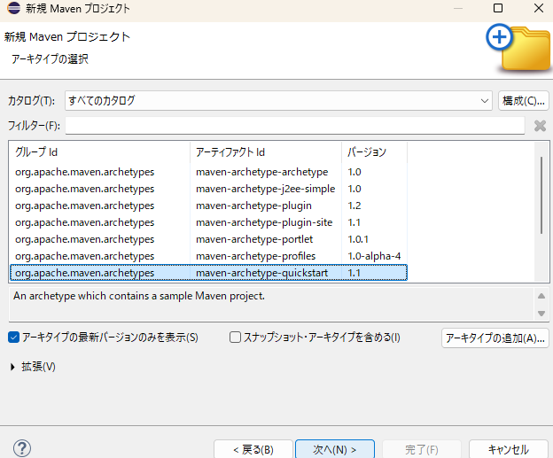
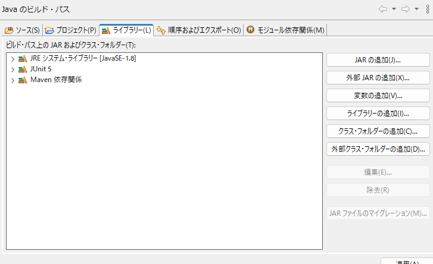

# Maveプロジェクト作成方法



- ループId	com.example
- アーティファクトId	{project}
- バージョン	0.0.1-SNAPSHOT
- パッケージ	com.example.helloworld


# Junit5導入



pom.xml
```xml
	<dependencies>
		<dependency>
			<groupId>junit</groupId>
			<artifactId>junit</artifactId>
			<version>4.11</version>
			<scope>test</scope>
		</dependency>
		<!-- 以下を追加 -->
		<dependency>
			<groupId>org.mockito</groupId>
			<artifactId>mockito-core</artifactId>
			<version>4.4.0</version>
			<scope>test</scope>
		</dependency>
		<dependency>
			<groupId>org.mockito</groupId>
			<artifactId>mockito-junit-jupiter</artifactId>
			<version>4.4.0</version>
			<scope>test</scope>
		</dependency>
		<!-- ここまで追加 -->
	</dependencies>
```

- Junit5ソース例
```java
import static org.junit.jupiter.api.Assertions.*;
import static org.mockito.Mockito.*;

import java.util.Date;

import org.junit.After;
import org.junit.Before;
import org.junit.jupiter.api.Test;
import org.junit.jupiter.api.extension.ExtendWith;
import org.mockito.InjectMocks;
import org.mockito.Mock;
import org.mockito.MockitoAnnotations;
import org.mockito.junit.jupiter.MockitoExtension;

@ExtendWith(MockitoExtension.class)
public class DisplayUserInfoTest {
	
	@Mock
	private UserInfo mockInfo;
	private AutoCloseable closeable;

	@InjectMocks
	private DisplayUserInfo target;
	
	@Before
	void initService() {
		closeable = MockitoAnnotations.openMocks(this);
	}
	
	@After
	void closeService() throws Exception{
		closeable.close();
	}
	
	@Test
	public void testMock() {
		when(mockInfo.getName("000001")).thenReturn("鈴木一郎");
		when(mockInfo.getGender("000001")).thenReturn("男");
		when(mockInfo.getOld("000001")).thenReturn("42");
		String result = target.getUserInfoString("000001");

		assertEquals("鈴木一郎(男) 42歳", result);
	}
	
	@Test
	void testMockDate() {
		// Dataクラスのインスタンスモック
		Date mockDate = mock(Date.class);

		//getTimeを返す
		when(mockDate.getTime()).thenReturn(1700000000000L);

		// テスト
		assertEquals(1700000000000L, mockDate.getTime());
		assertNotEquals(System.currentTimeMillis(), mockDate.getTime());
	}
}
```

- [JUnit5におけるMockitoの利用方法](https://qiita.com/kirin1218/items/37ed388759a4c7d94b75)