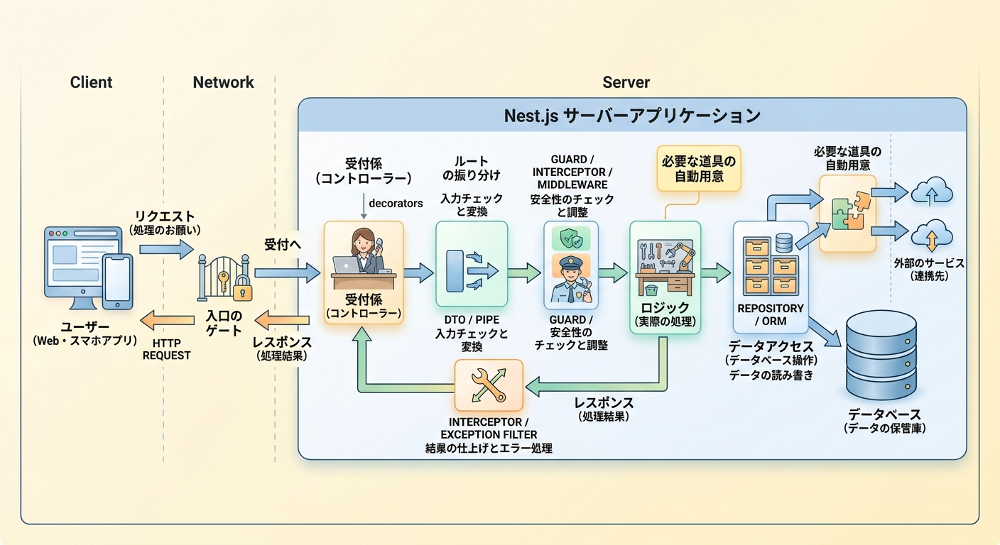

# Nest.jsについて

## Nest.jsとは

- TypeScriptで構築された、バックエンド開発のためのNode.jsフレームワーク
- NestJSはAngularのアーキテクチャや設計思想から非常に強く影響を受けて作られたフレームワーク
- SwaggerUIのツールを入れることでブラウザにAPI仕様を視覚的に表示する事ができる

> Angularとは

- **フロントエンド向けのWebアプリケーションフレームワーク**
- TypeScript で書かれており、SPA（Single Page Application）を効率よく構築するための機能一式（ルーティング、フォーム、HTTP通信、状態管理の土台など）が最初から揃っているのが特徴

> Swagger UIとは

- APIの仕様書をWebブラウザ上に視覚的かつ分かりやすく表示
- 動作テストも可能

> 主要な構成概念

|概念|NestJSでの役割|Angularでの役割|
|:----|:----|:----|
|Module (@Module)|機能単位（ユーザー管理、認証など）でコードをカプセル化する単位|関心事ごとにコードをまとめる単位|
|Service / Provider (@Injectable)|ビジネスロジックやDB操作を記述するクラス|ビジネスロジックを記述するクラス|
|Controller (@Controller)|リクエストを受け取りレスポンスを返すハンドラー|(※Angularではコンポーネント)|
|Pipe (@Injectable)|リクエストパラメータの検証（バリデーション）や型変換|表示データの整形・変換|
|Guard (@Injectable)|APIアクセスの認可（JWT検証やロールチェックなど）|画面の遷移可否（ルーティング保護）|
|Interceptor (@Injectable)|レスポンスの加工、例外処理、キャッシュ制御など||通信の前処理・後処理（ロギングなど）

- NestJSも、TypeScriptのデコレータ（ **@** から始まるアノテーション）をメタデータの付与やクラスの役割定義に多用
- 非同期処理ライブラリRxJS（Observable）は、NestJSでも組み込まれている



## インストール

```sh
# 初期インストール・アップデート
npm install -g @nestjs/cli

# Nest CLを用いてプロジェクト作成
nest new intro-nestjs

✨  We will scaffold your app in a few seconds..

# パッケージマネージャーを選択
✔ Which package manager would you ❤️  to use? npm
# 分散トレーシングやモニタリング（可観測性: Observability）の自動設定機能を有効化
## 開発の初期段階は機能なしで進める
✔ Would you like to enable auto-instrumented observability (@nestjs/observe)? No
# JavaScriptのモジュール形式
## ライブラリとの互換性が高く、NestJSのエコシステムで最も安定して動作
✔ Which module system would you like to use? CJS (CommonJS) [ with jest ]

Thanks for installing Nest 🙏
Please consider donating to our open collective
to help us maintain this package.
🍷  Donate: https://opencollective.com/nest

## Swagger パッケージのインストール
cd intro-nestjs
npm install @nestjs/swagger
```

## Nest.jsの構成

```sh
intro-nestjs/
├── src/
│   ├── main.ts        #アプリ起動処理/エントリーポイント
│   ├── app.module.ts  #ルートモジュール
│   ├── sample00/      # sample00の機能をまとめたディレクトリ
│   :   ：
│   │   └── sample01.module.ts
│   ├── sample01/                  # sample01の機能をまとめたディレクトリ
│   │   ├── sample01.controller.ts # リクエスト・レスポンスの受渡
│   │   ├── sample01.service.ts    # ビジネスロジック処理
│   │   └── sample01.module.ts     # sample01ルートモジュール
│   :
└── package.json               #依存パッケージ管理
```

## service.tsについて

- intro-nestjs\src\sample01\sample01.service.ts
- ビジネスロジックやDB操作を記述するクラス
- @Injectable

```js
import { Injectable } from '@nestjs/common';

@Injectable()
export class Sample01Service {
  getSample01Data(): { id: number; name: string } {
    // Sample01のデータを返す処理
    return { id: 1, name: 'Sample01のデータ' };
  }
}
```

## controller.tsについて

- intro-nestjs\src\sample01\sample01.controller.ts
- ルーティングを定義
- リクエストを受け取りレスポンスを返すハンドラー
- @Controller

```js
import { Controller, Get } from '@nestjs/common';
import { Sample01Service } from './sample01.service';

@Controller('sample01') // URLの接頭辞: /sample01
export class Sample01Controller {
  // DI（依存性注入）を使ってServiceを読み込む
  constructor(private readonly sample01Service: Sample01Service) {}

  @Get() // GET /sample01 へのリクエスト
  getSample01() {
    return this.sample01Service.getSample01Data();
  }

  @Get('detail') // GET /sample01/detail へのリクエスト
  getDetail() {
    return { message: 'Sample01の詳細データです' };
  }
}
```

## 機能別ルートモジュール(module.ts)について

- intro-nestjs\src\sample01\sample01.module.ts
- **@Module**
  - 機能単位（ユーザー管理、認証など）でコードをカプセル化する単位

```js
import { Module } from '@nestjs/common';
import { Sample01Controller } from './sample01.controller';
import { Sample01Service } from './sample01.service';

@Module({
  controllers: [Sample01Controller], // ルーティングを記述したControllers
  providers: [Sample01Service], // 処理を記述したProviders
})
export class Sample01Module {}


```

## 全ルートモジュール(app.module.ts)について

- intro-nestjs\src\app.module.ts
- ルートモジュールはNestがアプリケーショングラフの構築の始点
- **@Module**
  - 機能単位（ユーザー管理、認証など）でコードをカプセル化する単位

```js
import { Module } from '@nestjs/common';
import { Sample00Module } from './sample00/sample00.module';
import { Sample01Module } from './sample01/sample01.module';

@Module({
  imports: [
    Sample00Module, // 機能モジュールごとインポート
    Sample01Module,
  ],
  controllers: [],
  providers: [],
})
export class AppModule {}

```

## アプリ起動処理/エントリーポイント(main.ts)

- intro-nestjs\src\main.ts

```js
import { NestFactory } from '@nestjs/core';
import { SwaggerModule, DocumentBuilder } from '@nestjs/swagger';
import { AppModule } from './app.module';

async function bootstrap() {
  const app = await NestFactory.create(AppModule);
  // Swaggerドキュメントの基本情報を定義
  const config = new DocumentBuilder()
    .setTitle('Sample Management API')
    .setDescription('NestJSとSwaggerで作成したサンプルAPIドキュメントです')
    .setVersion('1.0.0')
    .addTag('sample', 'サンプルのAPI') // タグでグループ化
    .build();
  // ドキュメントオブジェクトの生成
  const document = SwaggerModule.createDocument(app, config);
  // Swagger UIを表示するパスを指定 (例: /docs)
  SwaggerModule.setup('docs', app, document);
  await app.listen(process.env.PORT ?? 3000);
  console.log('Swagger UI is available on: /docs');
}
bootstrap();
```

## nest.jsサーバー実行

```sh
## サーバー実行
npm run start
```

- http://localhost:3000/
- http://localhost:3000/sample01

## 開発サーバーでSwaggerUIを表示

```sh
## 開発サーバーで実行
npm run start:dev
```

- http://localhost:3000/docs


## 参考

[NestJS入門](https://zenn.dev/91works/articles/97e243841d7037)