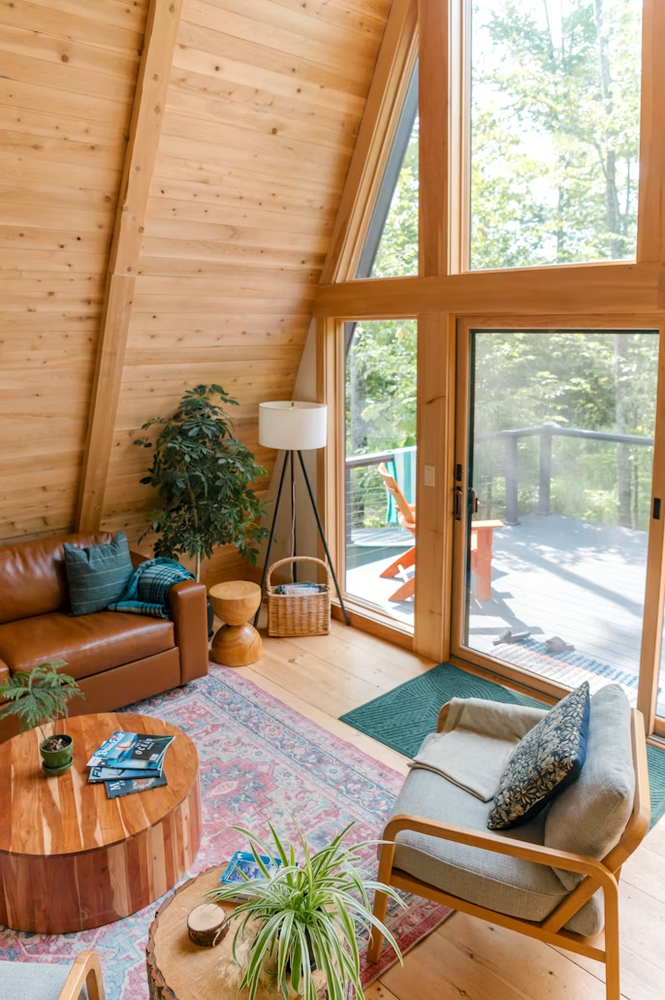

<!--
_color: white
_footer: 'フッタを入れることができます'
-->

# タイトル全面背景

「sample01.png」と透明感を入れた背景

---
<!--
_footer: 'フッタを入れることができます'
paginate: true
-->

### 左に画像をいれる

- 表示場所、比率を指定する
- 次頁では、複数画像を並べます
- footerで画像クレジット表示も

---
<!--
_footer: 'フッタを入れることができます'
paginate: true
-->

# 右に
#### 画像を入れる

画像２つ組み込む
