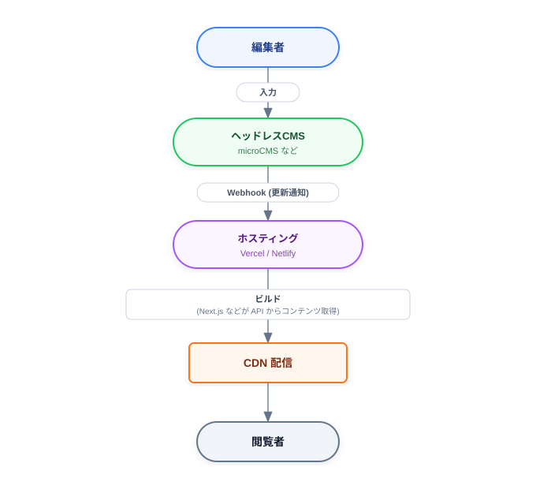

<!-- _class: title -->

# ヘッドレスCMS 入門ドキュメント

---

<!-- _class: toc -->

## 目次

1. CMS とは何か
2. 従来型CMS（モノリシックCMS）の構造
3. ヘッドレスCMS とは
4. 従来型CMS との比較
5. ヘッドレスCMS のメリット
6. ヘッドレスCMS のデメリット・注意点

---

<!-- _class: toc -->

## 目次

7. 主なヘッドレスCMS サービス
8. 一般的な構成例（Jamstack）
9. 導入判断の目安
10. 学習ステップ
11. 用語まとめ
12. まとめ

---

## 1. CMS とは何か

CMS（Content Management System / コンテンツ管理システム）とは、
Web サイトの文章・画像などのコンテンツを、専門知識がなくても
管理・更新できるようにするシステムです。

*   **代表例:** WordPress、Drupal、Movable Type
*   編集者は管理画面からコンテンツを入力する
*   HTML を直接書かなくてもページを公開できる

---

## 2. 従来型CMS（モノリシックCMS）の構造

従来型のCMSは、次の2つを1つのシステムとして持っています。

| 部分 | 役割 |
| :--- | :--- |
| **バックエンド (Body)** | コンテンツの保存・管理・編集画面 |
| **フロントエンド (Head)** | コンテンツを HTML ページとして表示する部分 |

つまり「入力」から「表示」までを1つの製品が担当します。

---

## 3. ヘッドレスCMS とは

**ヘッドレスCMS**とは、従来型CMSから「Head（表示部分）」を切り離し、
バックエンド（コンテンツ管理機能）だけに特化したCMSです。

*   コンテンツは API（REST / GraphQL）経由で JSON として配信される
*   表示側（Web、アプリ、デジタルサイネージなど）は自由に実装できる
*   「Headless（頭がない）」＝ 表示部分を持たない、という意味

### イメージ

```
[従来型CMS]
  編集画面 → データベース → テンプレート → HTML ページ
  （すべて1つのシステム内）

[ヘッドレスCMS]
  編集画面 → データベース → API(JSON)
                                 ↓
              Webサイト / スマホアプリ / サイネージ / ...
```

---

## 4. 従来型CMS との比較

| 観点 | 従来型CMS | ヘッドレスCMS |
| :--- | :--- | :--- |
| 表示部分 | CMS が持つ | 自分で実装する |
| 配信先 | 基本的に Web サイト1つ | Web・アプリなど複数に配信可能 |
| 技術選択の自由度 | テンプレート言語に依存 | フロントエンド技術は自由 |
| 導入の手軽さ | 高い（すぐ公開できる） | フロント開発が必要 |
| 表示速度 | サーバ処理に依存 | 静的化・CDN で高速化しやすい |
| セキュリティ | 公開サーバに管理画面がある | 管理画面と公開環境を分離できる |

---

## 5. ヘッドレスCMS のメリット

* **マルチデバイス配信**
    * 1つのコンテンツを Web サイト、スマホアプリ、サイネージなどへ同時配信できる。
* **フロントエンドの自由度**
    * React / Next.js / Vue / Nuxt など好きな技術で実装できる。
* **表示が高速になりやすい**
    * 静的サイト生成（SSG）や CDN 配信と相性が良い。
* **セキュリティ面で有利**
    * 管理画面が公開サーバ上になく、攻撃対象が小さい。
* **拡張性・保守性**
    * コンテンツ管理と表示が分離されるため、片方だけの刷新がしやすい。

---

## 6. ヘッドレスCMS のデメリット・注意点

* **フロントエンドの実装が必須**
    * 表示部分は自作するため、開発者のリソースが必要。
* **プレビューが手間になりやすい**
    * 「編集した内容がどう見えるか」を別途仕組みとして用意する必要がある。
* **初期コストが高くなりがち**
    * 小規模サイトでは従来型CMSの方が早く安く済むこともある。
* **運用体制が必要**
    * API 連携やデプロイの自動化など、技術的な運用知識が求められる。

---

## 7. 主なヘッドレスCMS サービス

| 種類 | 例 | 特徴 |
| :--- | :--- | :--- |
| SaaS 型（国産） | microCMS、Newt | 日本語対応・サポートが手厚い |
| SaaS 型（海外） | Contentful、Sanity、Storyblok | 多機能・大規模向け |
| オープンソース型 | Strapi、Directus、Payload CMS | 自前ホスティング可・カスタマイズ自由 |
| Git ベース | Netlify CMS(Decap)、Tina CMS | コンテンツを Git で管理 |

---

## 8. 一般的な構成例（Jamstack）

ヘッドレスCMS は「Jamstack」と呼ばれる構成でよく使われます。



**ポイント:**

*   コンテンツ更新をトリガーにサイトを自動ビルド・再配信する
*   閲覧者には CDN 上の静的ファイルが返るため高速

---

## 9. 導入判断の目安

### ヘッドレスCMS が向いているケース
* Web とアプリなど複数チャネルに同じコンテンツを配信したい
* 表示速度・SEO を重視したい
* モダンなフロントエンド技術で作りたい
* 開発者が確保できている

### 従来型CMS が向いているケース
* 小規模なコーポレートサイト・ブログ
* 開発リソースが限られている
* プラグインで機能を手早く揃えたい

---

## 10. 学習ステップ

* ヘッドレスCMS の SaaS（microCMS など）に無料登録し、API を触ってみる
* API から返る JSON の構造を確認する
* Next.js などで API を取得して一覧・詳細ページを作ってみる
* Vercel などにデプロイし、Webhook で自動ビルドを設定する
* プレビュー機能・下書き対応など、運用に必要な仕組みを追加する

---

## 11. 用語まとめ

| 用語 | 意味 |
| :--- | :--- |
| Head | コンテンツを表示するフロントエンド部分 |
| API | システム間でデータをやり取りする窓口。REST / GraphQL が主流 |
| JSON | API のやり取りで使われるデータ形式 |
| SSG | 静的サイト生成。あらかじめ HTML を作っておく方式 |
| CDN | 世界各地のサーバから配信し高速化する仕組み |
| Webhook | イベント発生時に外部へ通知する仕組み |
| Jamstack | JavaScript・API・Markup を組み合わせたモダンな構成 |

---

## 12. まとめ

- ヘッドレスCMS は「表示部分を持たない、API 配信特化のCMS」
- マルチデバイス配信・高速表示・技術選択の自由が大きな利点
- 一方でフロントエンド開発とプレビュー運用の設計が必要
- 規模と体制に応じて従来型CMS と使い分けることが重要
